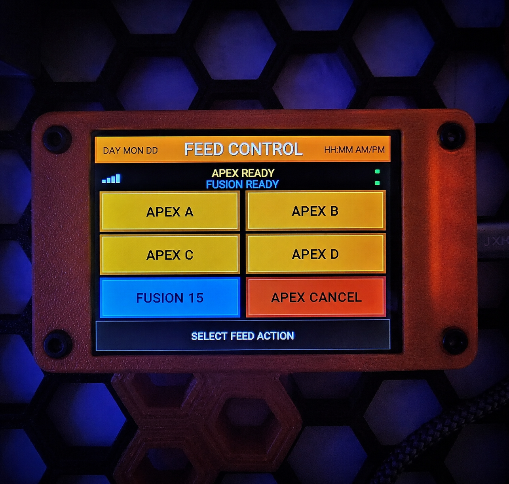
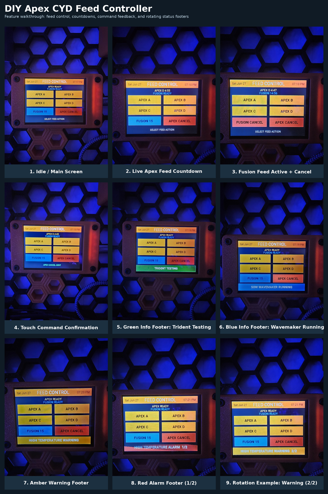

# DIY Apex CYD Feed Controller & Status Display

A local, at-the-tank touchscreen controller and status display for Neptune Apex, Home Assistant, ESPHome, and the ESP32-2432S028 CYD.

This project turns a 2.8-inch ESP32 touchscreen into a dedicated reef-tank control panel for Apex feed modes, Home Assistant automations, live countdowns, prioritized Apex alarms and warnings, and operational-status messages.

> Local LAN only: normal operation does not depend on Apex Fusion or any cloud service.



## Features

* Apex Feed A / B / C / D touchscreen buttons
* Apex Cancel button
* Optional Home Assistant-managed 15-minute Fusion-style feed workflow
* Dynamic Fusion button:

  * `FUSION 15` while idle
  * `FUSION CANCEL` while a Fusion feed is active
* Live Apex feed countdown using Apex-reported remaining time
* Live Fusion feed countdown
* Staged skimmer-restoration countdown
* Active Apex feed-button visual state
* Short pressed-button visual feedback
* Date and time header sourced from Home Assistant
* Wi-Fi signal-strength bars for the CYD
* Separate Apex REST-data freshness indicator
* Separate Home Assistant heartbeat freshness indicator
* Prioritized Apex alarm, warning, and operational-status footer
* Night dimming with wake-on-touch behavior
* Encrypted ESPHome API communication
* No Apex credentials stored on the touchscreen

## Architecture

```text
Neptune Apex local REST/XML endpoints
        ↓
Home Assistant REST integrations, scripts, automations, and Jinja templates
        ↓
Home Assistant entities and consolidated status text
        ↓
Encrypted ESPHome API
        ↓
ESP32-2432S028 CYD touchscreen
```

The CYD does not communicate directly with the Apex. Home Assistant is the bridge and logic layer.

## Screen Layout

```text
Date                 FEED CONTROL                 Time

Wi-Fi bars      Apex status / countdown      Apex freshness
               Fusion status / countdown    HA heartbeat freshness

APEX A                                      APEX B
APEX C                                      APEX D
FUSION 15 / FUSION CANCEL                   APEX CANCEL

Idle instruction, command confirmation, or prioritized alert/status footer
```

## Status and Safety Behavior

The footer receives one pipe-separated status entity from Home Assistant.

Example:

```text
A:LEAK DETECTED|W:HIGH TEMPERATURE WARNING|I:TRIDENT TESTING|B:SOW WAVEMAKER RUNNING
```

| Prefix   | Meaning              | Display behavior                                            |
| -------- | -------------------- | ----------------------------------------------------------- |
| `A:`     | Alarm                | Red blinking footer, priority locked                        |
| `W:`     | Warning              | Amber blinking footer, priority locked when no alarm exists |
| `I:`     | Informational status | Green solid footer                                          |
| `B:`     | Operational status   | Blue solid footer                                           |
| `NORMAL` | No active condition  | Normal idle footer                                          |

Priority behavior:

1. A red alarm displays first and remains on screen.
2. If no alarm exists, an amber warning displays first and remains on screen.
3. Green and blue informational statuses rotate every four seconds only when no alarm or warning is active.

The current public alert example supports:

* Apex virtual outputs beginning with `ALRM_`
* Apex virtual outputs beginning with `WARN_`
* Water Change active
* Outage Mode active
* Trident testing indicator
* SOW wavemaker running
* Return pump manually forced literal `OFF`

`AOF` means Apex Auto Off and does not trigger the manual-return warning.

The included Trident testing indicator is based on a virtual output or schedule. It is not confirmed direct live Trident module telemetry.

## Night Dimming

The screen runs at full brightness from 10:00 AM through 10:59 PM.

From 11:00 PM through 9:59 AM:

* The display dims to 20%.
* The first touch wakes the screen without activating a button.
* The display remains awake at full brightness for 60 seconds.
* Any active red alarm or amber warning forces full brightness until the priority condition clears.

## Fusion Feed Behavior

The optional Home Assistant-managed Fusion-style feed sequence does this:

```text
Start:
Return OFF
UV OFF
Skimmer OFF
Start 15-minute timer

Natural completion or Cancel:
Return ON
UV ON
Wait 1 minute
Skimmer ON
```

Important:

The included restore behavior is staged and reliable, but it is not a true arbitrary state snapshot-and-restore system.

If equipment was intentionally off before Fusion Feed started, the base example may turn it on during restoration. Test and customize this behavior for your own system.

## Repository Layout

```text
.
├── docs/
│   ├── apex-setup.md
│   ├── alerts-and-status.md
│   ├── customization.md
│   ├── hardware.md
│   ├── installation.md
│   ├── privacy-checklist.md
│   └── troubleshooting.md
├── esphome/
│   ├── secrets.example.yaml
│   └── tank-touch.example.yaml
├── home-assistant/
│   ├── apex-alerts-and-countdowns.example.yaml
│   ├── apex-outlet-status.example.yaml
│   ├── apex-rest.example.yaml
│   ├── apex-status.example.yaml
│   ├── fusion-feed.example.yaml
│   └── secrets.example.yaml
├── images/
├── .gitignore
├── CHANGELOG.md
├── LICENSE
└── README.md
```

## Quick Start

1. Read the [hardware guide](docs/hardware.md).
2. Read the [installation guide](docs/installation.md).
3. Add private values using the Home Assistant and ESPHome `secrets.example.yaml` files.
4. Install and test the Home Assistant examples.
5. Copy and customize `esphome/tank-touch.example.yaml`.
6. Flash the CYD through ESPHome.
7. Test every feed, cancel, timer, restore, alert, dimming, and restart behavior before relying on it around livestock.

## Home Assistant Components

| File                                      | Purpose                                                                                |
| ----------------------------------------- | -------------------------------------------------------------------------------------- |
| `apex-rest.example.yaml`                  | Apex Feed A/B/C/D and Cancel REST commands                                             |
| `apex-status.example.yaml`                | Apex feed-state and remaining-seconds polling                                          |
| `apex-outlet-status.example.yaml`         | Apex `status.xml` outlet-state polling                                                 |
| `apex-alerts-and-countdowns.example.yaml` | Fusion countdowns, Apex data freshness, heartbeat, and consolidated footer status text |
| `fusion-feed.example.yaml`                | Optional Home Assistant-managed staged Fusion feed sequence                            |
| `secrets.example.yaml`                    | Safe private-secret template                                                           |

See [Home Assistant configuration](home-assistant/README.md) for installation order and entity dependencies.

## ESPHome Components

The public CYD configuration is:

```text
esphome/tank-touch.example.yaml
```

It includes:

* CYD display and touch configuration
* Apex A/B/C/D and Cancel actions
* Dynamic Fusion Start / Fusion Cancel behavior
* Apex countdown smoothing between Home Assistant polls
* Fusion and skimmer-restoration countdown display
* Night dimming and wake-on-touch behavior
* Wi-Fi, Apex freshness, and Home Assistant heartbeat indicators
* Priority-aware alarm, warning, and informational footer behavior
* Active feed-button styling and short pressed-button feedback
* Touch calibration values from the original build

See [ESPHome configuration](esphome/README.md) before flashing.

## Screen States and Status Footer Examples

The controller provides at-a-glance confirmation for feed actions, live countdowns, network/controller freshness, and Apex-derived status conditions.



The walkthrough includes:

* Normal idle state with all feed controls available
* Live Apex feed countdown
* Active Fusion feed with dynamic cancel button
* Touch-command confirmation
* Green informational footer
* Blue operational footer
* Amber warning footer
* Red alarm footer
* Multiple-status rotation when no alarm or warning is active

## Security and Privacy

This repository intentionally does not include:

* Wi-Fi credentials
* ESPHome API encryption keys
* OTA passwords
* Apex IP addresses, hostnames, usernames, or passwords
* Home Assistant URLs or tokens
* Private network details
* Home Assistant backups, databases, or `.storage` files

Review the [privacy and security checklist](docs/privacy-checklist.md) before uploading YAML, logs, screenshots, or photos.

## Important Documentation

* [Hardware Overview](docs/hardware.md)
* [Installation Guide](docs/installation.md)
* [Neptune Apex Local API Setup](docs/apex-setup.md)
* [Alerts and Status Footer](docs/alerts-and-status.md)
* [Customization Guide](docs/customization.md)
* [Troubleshooting Guide](docs/troubleshooting.md)
* [Privacy and Security Checklist](docs/privacy-checklist.md)

## Disclaimer

This is an unofficial community project. It is not affiliated with or endorsed by Neptune Systems, Home Assistant, ESPHome, or any hardware manufacturer.

Always test feed behavior, restore logic, alert behavior, dimming behavior, and restart recovery before relying on this project around livestock or life-support equipment.
